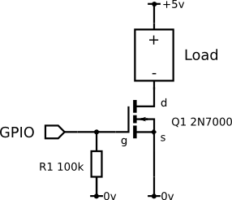

## Device controller

This is just a simple arduino sketch for controlling the reset of a device.  Use this in junction with a python script to for example to a perpetual reset of a device to test how well it works.  Can also be used with for example a MOSFET switch or a relay (see below)

